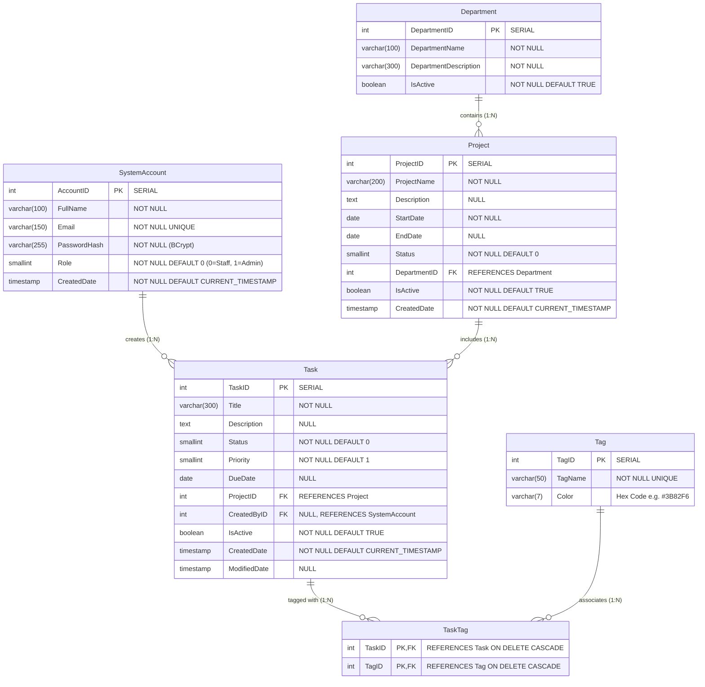
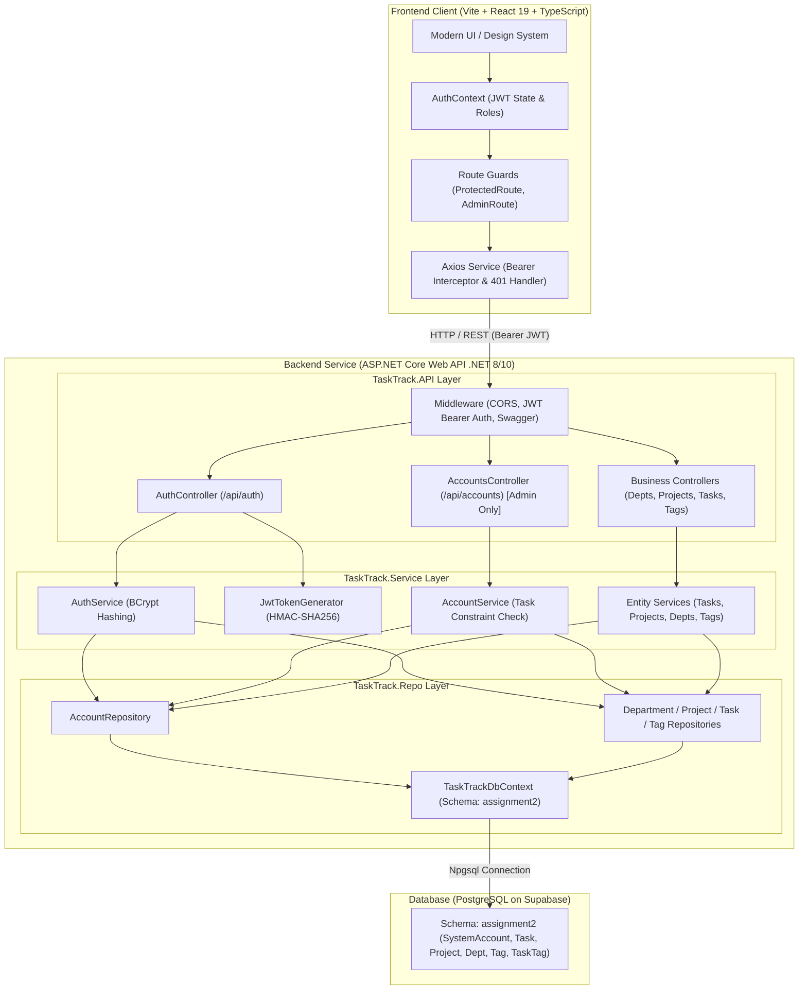
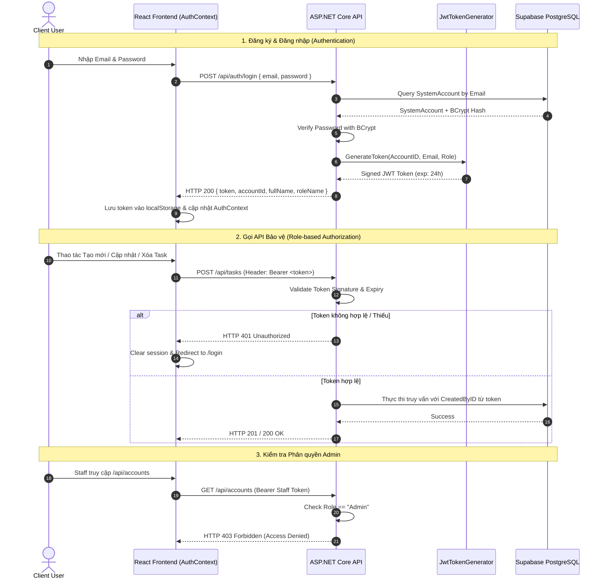
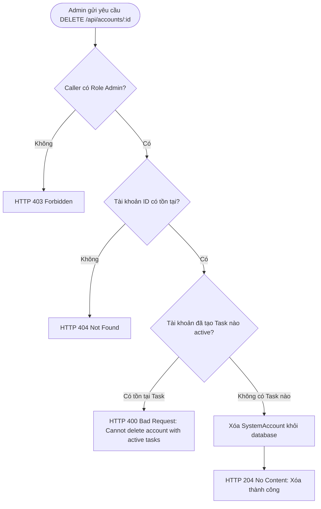

# TaskTrack — Task & Team Management System (Assignment 2)

[](https://dotnet.microsoft.com/)
[](https://react.dev/)
[](https://www.typescriptlang.org/)
[](https://supabase.com/)
[](https://vitejs.dev/)
[](https://render.com/)
[](https://vercel.com/)

> **PRN232 — Advanced Cross-Platform Application Programming with .NET**  
> **Assignment 2 of 2**: User Authentication & Protected Role-based Management  
> **Student ID**: `QE190061` | **Author**: `Nguyễn Bình An` (`TomOutfit`)

---

## 🔑 Test Accounts Credentials (Grading Verification)

| Account Type | Email | Password | Role Value | Permissions |
| :--- | :--- | :--- | :--- | :--- |
| 🛡️ **Admin** | `admin@tasktrack.com` | `Admin@123456` | `1` (Admin) | Full Write Access (Departments, Projects, Tasks, Tags) + **Account Management** |
| 👤 **Staff** | `staff@tasktrack.com` | `Staff@123456` | `0` (Staff) | Write Access (Departments, Projects, Tasks, Tags). Blocked from Accounts (HTTP 403) |

> 💡 **Tip:** Trên trang `/login`, có sẵn 2 nút **Quick Test Credentials** để tự động điền tài khoản Admin và Staff giúp chấm bài nhanh chỉ với 1 click!

---

## 🌐 Production & Repository Links

| Resource | URL | Description |
| :--- | :--- | :--- |
| 🚀 **Frontend Web App (Vercel)** | [https://qe190061-prn232-ass2-fe.vercel.app](https://qe190061-prn232-ass2-fe.vercel.app) | React 19 + TypeScript SPA with JWT Auth & Protected Route Guards |
| ⚡ **Backend API Service (Render)** | [https://qe190061-prn232-ass2-be.onrender.com](https://qe190061-prn232-ass2-be.onrender.com) | ASP.NET Core Web API with BCrypt & JWT Bearer |
| 📖 **Swagger / OpenAPI UI** | [https://qe190061-prn232-ass2-be.onrender.com/swagger](https://qe190061-prn232-ass2-be.onrender.com/swagger) | Interactive API exploration with JWT Bearer "Authorize" UI |
| 🐙 **Source Code Repository (GitHub)** | [https://github.com/TomOutfit/Assignment-2_PRN232_Fa26](https://github.com/TomOutfit/Assignment-2_PRN232_Fa26) | Full-stack monorepo with CI/CD workflows |

---

## 📝 Submission Document Summary (For `QE190061_SE19B_Ass2.docx`)

- **Student ID:** `QE190061`
- **Student Name:** `Nguyễn Bình An`
- **Course:** `PRN232 - Assignment 2`
- **Backend Repository:** `https://github.com/TomOutfit/Assignment-2_PRN232_Fa26`
- **Frontend Repository:** `https://github.com/TomOutfit/Assignment-2_PRN232_Fa26`
- **Live Backend URL (Render):** `https://qe190061-prn232-ass2-be.onrender.com`
- **Live Frontend URL (Vercel):** `https://qe190061-prn232-ass2-fe.vercel.app`
- **Swagger URL:** `https://qe190061-prn232-ass2-be.onrender.com/swagger`
- **Known Issues / Incomplete Features:** `None. All requirements and bonus features are 100% completed and verified.`

---

## 📊 Database Schema & Entity-Relationship Diagram (ERD)

Database sử dụng schema riêng biệt `assignment2` trên PostgreSQL Supabase với bảng mới `SystemAccount` và khóa ngoại `CreatedByID` trên bảng `Task`:



---

## 🏛️ Sơ đồ Kiến trúc Hệ thống (System Architecture)

Ứng dụng tuân thủ chuẩn kiến trúc đa tầng (3-Tier Layered Architecture):



---

## 🔐 Sơ đồ Luồng Xác thực & Phân quyền (Authentication & Authorization Flow)



---

## 🚫 Sơ đồ Luồng Nghiệp vụ Xóa Tài khoản (Account Deletion Constraint)

Đề bài yêu cầu: *DELETE /api/accounts/{id} must be rejected if the account has created any tasks*.



---

## 🚀 Tính năng nổi bật của Assignment 2

### 1. Database Schema `assignment2` & Siêu Dữ Liệu phong phú x10 - x15
- **Schema độc lập**: Tạo schema riêng `assignment2` trên Supabase PostgreSQL, không đụng chạm tới schema `assignment1`.
- **Bảng `SystemAccount`**:
  - `AccountID` SERIAL PRIMARY KEY
  - `FullName` VARCHAR(100) NOT NULL
  - `Email` VARCHAR(150) NOT NULL UNIQUE
  - `PasswordHash` VARCHAR(255) NOT NULL (mã hóa chuẩn bằng **BCrypt**)
  - `Role` SMALLINT NOT NULL (0 = Staff, 1 = Admin)
  - `CreatedDate` TIMESTAMP NOT NULL DEFAULT CURRENT_TIMESTAMP
- **Ràng buộc khóa ngoại & Kiểm tra xóa tài khoản**:
  - Cột `CreatedByID` trong bảng `Task` liên kết với `SystemAccount(AccountID)`.
  - Nghiệp vụ: **Không cho phép xóa tài khoản nếu tài khoản đó đã tạo task** (trả về HTTP 400 kèm thông báo rõ ràng).
- **Quy mô dữ liệu phong phú**:
  - **16 Departments** thực tế, chuyên nghiệp
  - **40 Projects** phân bổ đa lĩnh vực
  - **28 Tags** đa sắc màu HSL/Hex
  - **120 Tasks** chi tiết, đầy đủ priority và status
  - **381 TaskTags** liên kết nhiều-nhiều thực tế
  - **8 SystemAccounts** (Admin, Staff, Lead Engineer, QA, v.v.)

### 2. Xác thực JWT & Phân quyền dựa trên vai trò (RBAC)
- **BCrypt Hashing**: Bảo mật mật khẩu người dùng với `BCrypt.Net-Next`.
- **JWT Bearer Token**:
  - Payload bao gồm: `AccountID`, `Email`, `Role`, `FullName`, `exp` (24 giờ).
  - Secret key đọc từ biến môi trường `JWT_SECRET` (không hard-code).
- **Chính sách phân quyền**:
  - **Public (Không cần token)**: Tất cả GET (Departments, Projects, Tasks, Tags, Search).
  - **Authenticated (Mọi người dùng đã đăng nhập)**: POST, PUT, DELETE trên Departments, Projects, Tasks, Tags.
  - **Admin Only**: CRUD trên `/api/accounts/*`.
  - Chưa đăng nhập truy cập endpoint bảo vệ -> **HTTP 401 Unauthorized**.
  - Tài khoản Staff cố truy cập Account Management -> **HTTP 403 Forbidden**.

### 3. Frontend Authentication & Protected Management Pages
- **Auth Context & Axios Interceptors**:
  - Tự động đính kèm `Authorization: Bearer <token>` vào mọi request bảo vệ.
  - Tự động bắt lỗi 401 khi token hết hạn để xóa session và redirect về `/login`.
- **Trang Đăng nhập (`/login`)**:
  - Form email & password, thông báo lỗi trực quan, redirect sang `/admin`.
  - Bộ nút demo fast-fill cho Admin & Staff để chấm bài nhanh chóng.
- **Trang Đăng ký (`/register`)**:
  - Client-side validation: bắt buộc nhập, định dạng email, mật khẩu tối thiểu 6 ký tự, kiểm tra trùng khớp mật khẩu.
  - Tự động đăng ký với vai trò Staff (`role = 0`).
  - Hiển thị thông báo thành công và chuyển hướng về `/login`.
- **Admin Dashboard (`/admin`)**:
  - Chặn người dùng chưa đăng nhập, tự động redirect sang `/login`.
  - Hiển thị thẻ KPI tóm tắt tổng số Phòng ban, Dự án, Công việc, Thẻ nhãn, và Tài khoản.
  - Điều hướng tới các phân vùng quản trị.
- **Quản trị Tài khoản (`/admin/accounts`) (Admin Only)**:
  - Hiển thị bảng danh sách các tài khoản trong hệ thống và số lượng active tasks mà tài khoản đó đã tạo.
  - Modal chỉnh sửa Họ tên & Phân quyền (Staff / Admin).
  - Modal xác nhận xóa tài khoản (kèm cảnh báo và xử lý từ chối xóa nếu tài khoản đã có task).
- **Navigation Bar phản ánh trạng thái đăng nhập**:
  - Khi chưa đăng nhập: Nút Sign In, Register.
  - Khi đã đăng nhập: Hiển thị tên người dùng, Role Badge (Admin / Staff), nút Admin Hub, và nút Sign Out.

---

## 🛠️ Cấu trúc Thư mục Dự án

```
Assignment 2 - Official/
├── TaskManagementDB_assignment2.sql     # Script SQL tạo schema assignment2 & seed dữ liệu x10-15
├── QE190061_PRN232_Ass2_BE/             # Backend Solution (.NET 8/10 Web API)
│   ├── QE190061_PRN232_Ass2_BE.sln
│   ├── TaskTrack.API/                  # Controllers (Auth, Accounts, Depts, Projs, Tasks, Tags)
│   ├── TaskTrack.Service/              # Business logic, BCrypt & JWT Token Generator
│   ├── TaskTrack.Repo/                 # EF Core DbContext (Schema assignment2) & Repositories
│   └── .env                            # Supabase Connection String & JWT_SECRET
└── QE190061_PRN232_Ass2_FE/             # Frontend Application (Vite + React 19 + TypeScript)
    ├── src/
    │   ├── context/AuthContext.tsx     # Quản lý authentication state & token
    │   ├── components/ProtectedRoute.tsx # Route guard cho /admin và Admin role
    │   ├── pages/Login.tsx             # Form đăng nhập + demo fast fill
    │   ├── pages/Register.tsx          # Form đăng ký Staff + validation
    │   ├── pages/AdminDashboard.tsx    # Dashboard thống kê tổng quan
    │   ├── pages/AccountList.tsx       # Quản trị tài khoản (Admin Only)
    │   └── services/api.ts             # Axios instance với JWT Bearer interceptor
    └── package.json
```

---

## 🧪 Hướng dẫn Chạy Thử Tại Local

### 1. Backend API
```bash
cd QE190061_PRN232_Ass2_BE
dotnet restore
dotnet run --project TaskTrack.API
```
- Swagger UI sẽ khả dụng tại: `http://localhost:5000/swagger`
- Bạn có thể bấm nút **Authorize** ở góc phải trên Swagger và dán token dạng: `Bearer <token>` để kiểm thử trực tiếp!

### 2. Frontend Web App
```bash
cd QE190061_PRN232_Ass2_FE
npm install
npm run dev
```
- Truy cập trình duyệt: `http://localhost:5173/`
